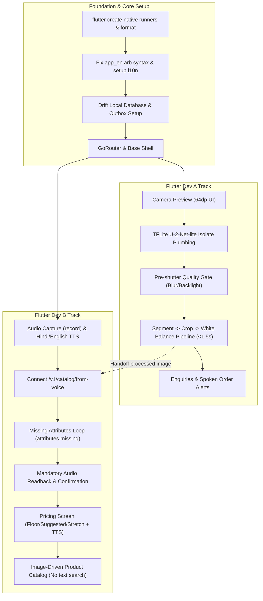

# Shilpsetu Mobile Application — App Developer Implementation Plan

## Executive Summary

**Shilpsetu** is an AI-powered market on-ramp designed for marginalised craft artisans (SIH 2026, PS 26090). The mobile application is **Android-first**, built with **Flutter**, and strictly adheres to an **offline-first, zero-literacy interaction model** (voice, camera, and tap only; no typing on the critical path).

Mobile development is partitioned between two complementary roles to prevent merge conflicts and maintain clean ownership boundaries:
- **Flutter App Dev A**: Camera & Capture Pipeline, On-device ML (TFLite in Isolates), Quality Gates, and Buyer Enquiries.
- **Flutter App Dev B**: Voice Cataloger, Conversational Follow-up Q&A, Audio/TTS Readback, Catalog UI, Pricing UI, and Multi-language Localization (l10n).

---

## Non-Negotiable Constraints & Architecture Rules

1. **Zero-Literacy Critical Path**: No text typing anywhere in the artisan onboarding or product creation flow. All interactions are driven by voice, icons, large visual tap targets, and spoken TTS prompts.
2. **Touch Targets**: Minimum interactive touch target is **64dp** (`Sizes.minTouchTarget`); primary action targets are **96dp** (`Sizes.primaryActionTarget`).
3. **Triple-Channel Accessibility**: Color alone never conveys meaning. Every status/state must be conveyed via **Color + Icon + Spoken Audio (TTS)**.
4. **Offline-First UI**: Local SQLite/Drift database is the single source of truth for UI renders (ADR-0001). Network calls write to local store/outbox; UI never blocks on network responses.
5. **On-Device ML Latency & Size Budgets**:
   - On-device segmentation budget: **< 1.5 s** on the reference device (₹7,000 Android, 2GB RAM).
   - Total model bundle size: **<= 25 MB** (ADR-0003).
6. **Financial Precision**: Money calculations strictly use `Decimal` (never floating-point `double`).
7. **Clean Architecture by Feature**:
   ```
   lib/features/<feature_name>/
   ├── domain/        # Pure Dart entities and use case interfaces (No Flutter imports)
   ├── data/          # Drift DAOs, API client, repository implementations
   └── presentation/  # Riverpod state notifiers, screens, and accessible widgets
   ```

---

## Phase 0 & Phase 1 Roadmap



---

## Detailed Task Breakdown

### 1. Foundation & Core Setup (Shared / Day 1)

- [ ] **Generate Native Platforms**: Run `flutter create . --platforms=android,ios --org in.shilpsetu` inside `apps/mobile/`.
- [ ] **Fix & Standardize ARB Files**: Fix syntax in `apps/mobile/lib/l10n/app_en.arb` and ensure seamless `flutter gen-l10n` generation for `en-IN` and `hi-IN`.
- [ ] **Core Navigation**: Set up `go_router` in `lib/core/router/` with a high-contrast, zero-literacy bottom navigation shell.
- [ ] **Drift Database Schema**: Define tables in `lib/core/database/` (`products`, `product_media`, `outbox`, `drafts`) supporting monotonic sequence sync (ADR-0001).

---

### 2. Flutter Dev A — Capture, On-Device ML & Enquiries

**Folders Owned**: `lib/features/capture/`, `lib/features/enquiries/`, `lib/ml/`

#### Phase 0 (By Sept 2)
1. **Camera Feed & Overlay**:
   - Implement `CameraController` with 64dp/96dp touch targets.
   - Add spoken capture guidance ("Show me what you made").
2. **TFLite Isolate Framework**:
   - Set up background isolate worker for `tflite_flutter` so inference never drops frames on the UI thread.
   - Benchmark initial U-2-Net-lite INT8 model; log and verify latency on target hardware.

#### Phase 1 (By Sept 14 — Scope Freeze)
3. **Pre-Shutter Quality Gate**:
   - Compute Laplacian variance (blur detection) and brightness histogram (backlight/underexposure).
   - Invalidate shutter when quality fails and trigger localized spoken guidance (e.g., "Too dark, move to sunlight").
4. **Image Processing Pipeline**:
   - Background isolate: Segment subject $\rightarrow$ Auto-crop bounding box $\rightarrow$ White-balance/exposure normalize.
   - Persist local processed image and hand off file reference to cataloger flow.
5. **Buyer Enquiries & Orders (`features/enquiries`)**:
   - Server-authoritative query for buyer interests and orders.
   - Spoken audio alert readout in artisan's chosen dialect/language.

---

### 3. Flutter Dev B — Voice Cataloger, Catalog, Pricing & Localization

**Folders Owned**: `lib/features/cataloger/`, `lib/features/catalog/`, `lib/features/pricing/`, `lib/l10n/`

#### Phase 0 (By Sept 2)
1. **Voice Capture & TTS Service**:
   - Implement `record` package with 96dp mic button holding state animations.
   - Configure `flutter_tts` with Hindi (`hi-IN`) and English (`en-IN`) voice synthesis.
2. **Connect Generated API**:
   - Bind `ref.watch(apiProvider).catalogFromVoice(...)` to convert base64 audio into `CatalogOut`.
3. **Localization Completeness**:
   - Add all initial prompt strings across `app_en.arb` and `app_hi.arb`.

#### Phase 1 (By Sept 14 — Scope Freeze)
4. **Conversational Cataloger Flow**:
   - Record initial audio $\rightarrow$ Display extracted `ProductAttributes`.
   - Iteratively check `attributes.missing` (e.g. `hours_to_make`, `materials`) and speak questions one at a time.
5. **Mandatory Spoken Readback**:
   - Read generated craft title and rich description aloud using TTS.
   - Provide large Confirm (`Palette.affirm`) or Re-record (`Palette.revise`) buttons. Readback is mandatory for non-literate verification.
6. **Triple-Band Pricing UI (`features/pricing`)**:
   - Query `/v1/pricing/quote` with craft ID, state, hours, and material cost.
   - Render 3 price tiers: **Floor** (Fair-wage minimum), **Suggested** (Market average), **Stretch** (Premium).
   - Use `Palette.belowFloor` with visual warning icon and spoken explanation if custom price falls below floor.
7. **Visual Product Catalog (`features/catalog`)**:
   - Pure image-driven grid of artisan's products loaded directly from Drift.
   - Tap product card $\rightarrow$ spoken summary of status and price.

---

## Verification & Testing Plan

### Automated Checks
```bash
# Code Formatting & Static Analysis
dart format --set-exit-if-changed .
flutter analyze --fatal-infos

# Unit & Widget Tests
flutter test
```

### Reference Device Verification
- Deploy APK to target reference device (Android 2GB RAM, low-tier SoC).
- Measure segmentation isolate latency (< 1500 ms).
- Confirm zero audio glitches/hiccups during TTS execution.
- Validate offline persistence: kill network, capture draft product, restart app, verify data intact in Drift.
